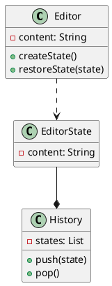

# Memento pattern

## Why?
* This pattern is used to implement undo mechanism.

let's say we have `content` which stores whatever we store, 
but when we do undo it should restore whatever previously typed.
For this we can use `prevContent`, But with this approach we can only undo once.
So we should have `prevContents` a list of previous contents, Still we have an issue here 
i.e when add something new like `title` we need one more list something like `prevTitles` to store previous titles.
We can't do this for everything we type. This is where **Memento pattern** comes to rescue.

## UML

* Whenever we set content of `Editor` we can create a `EditorState` with this new content and push it in history
* When we want to undo we call `Editor` restore method by passing the `EditorState` which we get by popping out history
