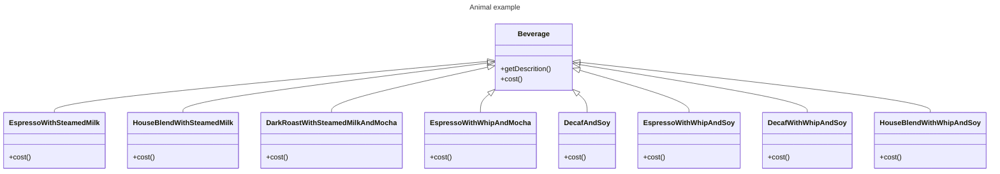

* The problem we have several condiments,
* for now we have created 2 classes which will take care of condiments
* but what if you want to change these condiments, or add new condiments
* we will have a lot of classes causing class explosion

